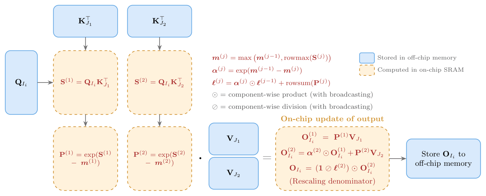
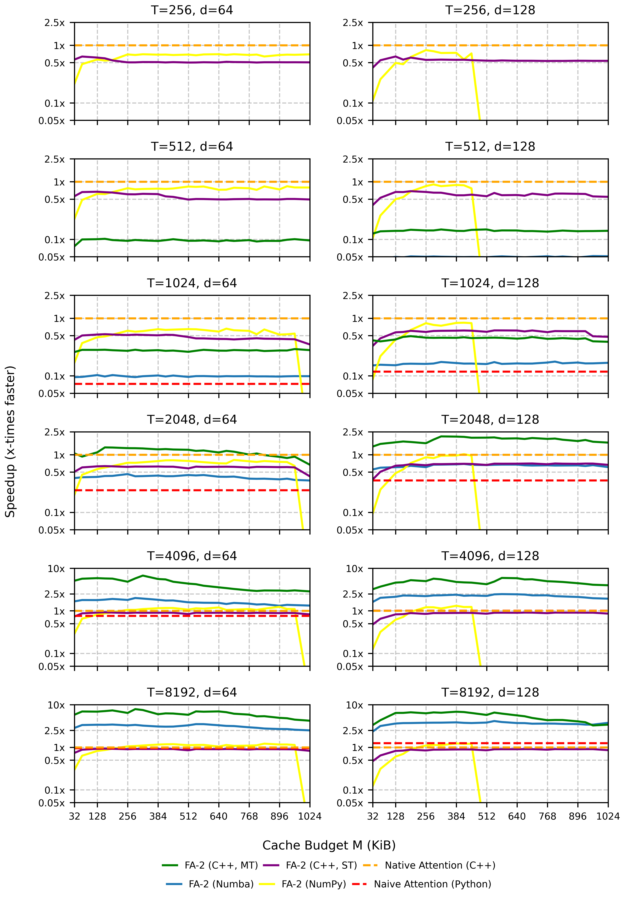
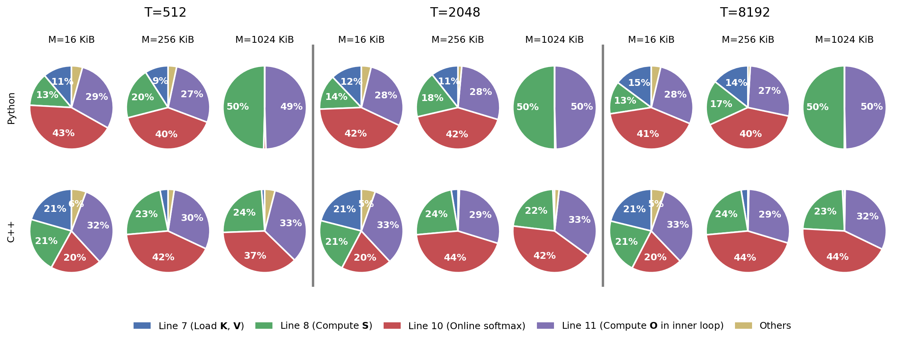

Peformance Evaluation of FlashAttention-2 on CPU
=======================
This repository contains implementations of the FlashAttention-2 forward pass on CPU. Both the C++ and Python implementations include single- and multi-threaded versions. Standard attention baselines are also provided. For causal attention, we benchmark three scheduling strategies: static, centralized dynamic, and work-stealing.

The technical report, including algorithm derivation, complexity analysis, and interpretation, is available here:
* [Performance Evaluation of FlashAttention-2 on CPU (PDF)](./flashattn2-cpu-report.pdf)
* [Google Drive Backup](https://drive.google.com/file/d/1Ui7b7OmlLXq72F-xsxJRqMYaqPPlKO0-/view?usp=drive_link)

Experimental Results
------------
**TL;DR:** We evaluate the performance of FlashAttenion-2 forward kernel on CPU.

FlashAttention-2 uses tiled attention and kernel fusion to reduce I/O and accelerate computation. 
However, because this algorithm is explicitly designed for GPUs, its behavior on CPUs remains largely underexplored. This gap is significant as CPU inference remains critical for resource-constrained environments.

<br>
<p align="center">
  
  <br>
  <em>Figure 1: Computation of the FlashAttention-2 forward pass.</em>
</p>

<details>
<summary><b>Speedup compared to standard attention.</b></summary><br>

<br>
<p align="center">
  
  <br>
  <em>Figure 2: Multi-threaded C++ FA-2 achieves up to a <strong>7.9x speedup</strong> on long sequences.
Standard C++ attention remains faster for short sequences.</em>
</p>
</details>

<details>
<summary><b>Runtime distribution profiling.</b></summary><br>

<br>
<p align="center">
  
  <br>
  <em>Figure 3: Profiling shows the online softmax consumes a significant portion of runtime, although having a smaller order of computational complexity.</em>
</p>
</details>

Dependencies
------------
- **Python:** numpy, numba, pandas, matplotlib
- **C++:** Eigen3 ≥ 3.3, OpenMP, CMake ≥ 3.16, C++17 compiler

Usage
-----
```bash
cmake -S . -B build && cmake --build build --parallel
bash run.sh
```

Logs go to `outputs/<impl>/runtime.csv`; Plots go to `outputs/plots/`

Each benchmark resumes from existing CSV entries if interrupted.
